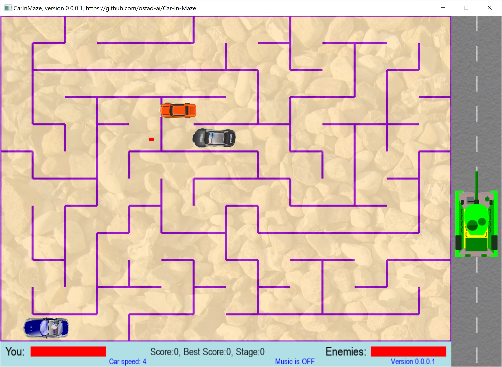
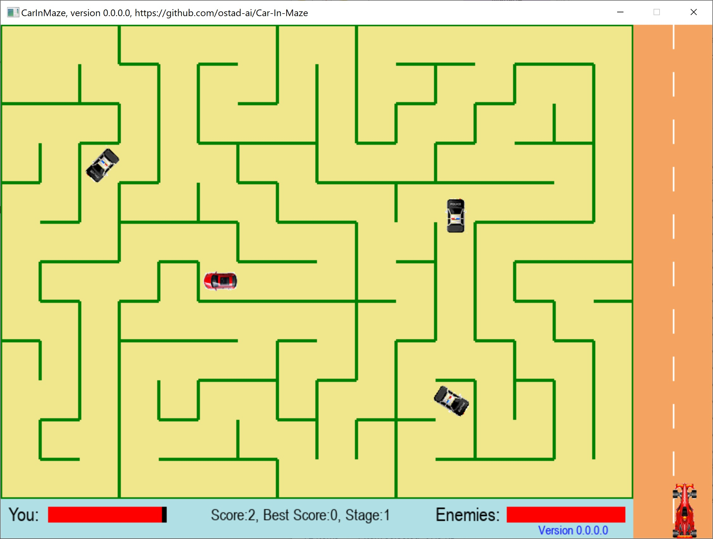

# CarInMaze
### Newest: version 0.0.0.1
1. An accurate collision between cars and bullets.
2. Simple particle effect on Collision.
3. Explosion effect on destruction of cars.
4. Two different animated cars for enemy.
5. Four different player's cars, which you can choose by key R.
6. A tank that shoots into the scene.
7. Different color themes, which you can change by pressing key L.
8. Adding textures to the scene.
9. Background music is also included, which you can turn it On or Off by key M.
## This archive includes the executable program, carinmaze.exe, which you should click on to run.
[Download the archive for win64](https://drive.google.com/file/d/1ihbQM8v7ryfO53O4YLWHF5OcJnQMSg5b/view?usp=sharing)
---
 *Figure 1: A snapshot of Car-In-Maze, version 0.0.0.1, while playing the game.*
--- 
### Older version 0.0.0.0
1. A shooting 2d car game in maze.
2. you can shoot bullets by clicking Space key.
---
 *Figure 1: A snapshot of Car-In-Maze, version 0.0.0.0, while playing the game.*
--- 